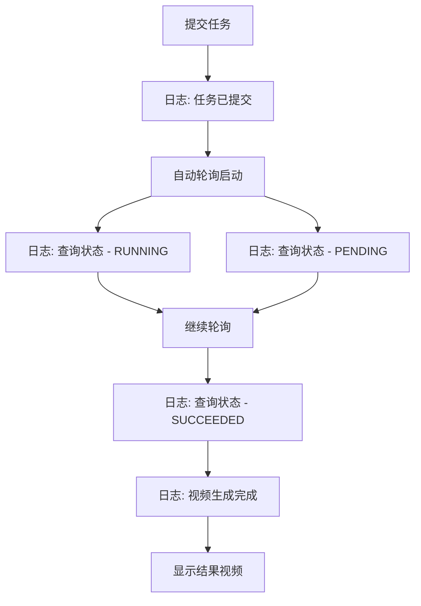

# Seed Horse Edit 改进方案

## 问题总览

| # | 问题 | 根因 | 影响文件 |
|---|------|------|----------|
| 1 | 中文素材名无法正确显示 | 服务端文件名正则 `[^\w.-]` 将中文替换为 `-`，且 multer 对中文 originalname 编码处理可能异常 | `src/server/server.ts` |
| 2 | 多个视频/图片素材无法正确预览 | `previewAsset()` 只取第一个素材，`renderInputPreview()` 只渲染单个预览 | `src/client/app.ts`, `public/index.html`, `public/styles.css` |
| 3 | 阿里区域字段多余 | readonly 且固定值"国内北京"，未参与任何逻辑 | `public/index.html`, `src/client/app.ts` |
| 4 | 缺少处理过程显示 | 无日志面板，手动轮询无自动追踪 | `src/client/app.ts`, `public/index.html`, `public/styles.css` |

---

## 问题 1：中文素材名无法正确显示

### 根因分析

[`server.ts:94`](src/server/server.ts:94) 中的正则：

```typescript
.replace(/[^\w.-]+/g, '-')
```

`\w` 仅匹配 `[A-Za-z0-9_]`，中文字符被全部替换为 `-`。实际 uploads 目录中已出现 `--.mp4`、`--.jpg` 这样的文件名。

同时，multer 返回的 `file.originalname` 在某些浏览器/编码场景下可能存在中文乱码问题。

### 修复方案

**服务端 `server.ts`：**

1. 修改磁盘文件名正则，保留中文和常见 Unicode 字符：

   ```typescript
   // 之前：将所有非 \w 字符替换为 -
   .replace(/[^\w.-]+/g, '-')
   
   // 之后：仅移除文件系统不安全字符，保留中文等 Unicode
   .replace(/[<>:"/\\|?*\x00-\x1f]+/g, '-')
   ```

2. 在 `/api/upload` 路由中，对 `originalname` 做 UTF-8 修复处理（兼容旧版浏览器编码）：

   ```typescript
   function sanitizeOriginalName(name: string): string {
     try {
       // 某些浏览器以 latin1 发送文件名，尝试修复
       const buf = Buffer.from(name, 'latin1');
       const decoded = buf.toString('utf-8');
       // 简单启发式：如果解码后看起来合理则使用
       if (!decoded.includes('\ufffd')) return decoded;
     } catch { /* 保持原样 */ }
     return name;
   }
   ```

3. 上传响应中使用修复后的 `originalname`：

   ```typescript
   name: sanitizeOriginalName(file.originalname),
   ```

---

## 问题 2：多个视频/图片素材无法正确预览

### 根因分析

[`app.ts:138-143`](src/client/app.ts:138) 的 `previewAsset()` 只返回第一个匹配素材：

```typescript
function previewAsset(): Asset | undefined {
  return (
    state.assets.find((asset) => asset.kind === 'video') ||
    state.assets.find((asset) => asset.kind === 'image') ||
    state.assets.find((asset) => asset.kind === 'audio')
  );
}
```

[`app.ts:146-170`](src/client/app.ts:146) 的 `renderInputPreview()` 只渲染单个预览元素。

### 修复方案

**将输入预览区从单预览改为多素材画廊：**

1. **删除** `previewAsset()` 函数（不再需要）

2. **重写** `renderInputPreview()` 为画廊模式：

   ```typescript
   function renderInputPreview(): void {
     if (!state.assets.length) {
       inputStage.innerHTML = '<i data-lucide="clapperboard"></i><span>等待素材</span>';
       lucide.createIcons();
       return;
     }
   
     inputStage.innerHTML = state.assets.map((asset, index) => {
       const url = escapeHtml(asset.url);
       const name = escapeHtml(asset.name);
       if (asset.kind === 'video') {
         return `<div class="preview-thumb" data-index="${index}">
           <video controls playsinline preload="metadata" src="${url}" title="${name}"></video>
           <span class="thumb-label">${name}</span>
         </div>`;
       } else if (asset.kind === 'image') {
         return `<div class="preview-thumb" data-index="${index}">
           
           <span class="thumb-label">${name}</span>
         </div>`;
       } else {
         return `<div class="preview-thumb audio-thumb" data-index="${index}">
           <i data-lucide="audio-lines"></i>
           <strong>${name}</strong>
           <audio controls src="${url}"></audio>
         </div>`;
       }
     }).join('');
     lucide.createIcons();
   }
   ```

3. **CSS 新增画廊样式**（`styles.css`）：

   ```css
   .preview-stage {
     display: grid;
     grid-template-columns: repeat(auto-fill, minmax(180px, 1fr));
     gap: 8px;
     overflow: auto;
   }
   
   .preview-thumb {
     position: relative;
     border-radius: 6px;
     overflow: hidden;
     background: #1a1816;
   }
   
   .preview-thumb video,
   .preview-thumb img {
     width: 100%;
     max-height: 200px;
     object-fit: contain;
     display: block;
   }
   
   .thumb-label {
     display: block;
     padding: 4px 6px;
     color: #f9f1df;
     font-size: 11px;
     overflow: hidden;
     text-overflow: ellipsis;
     white-space: nowrap;
   }
   
   .audio-thumb {
     padding: 12px;
     text-align: center;
     color: #f9f1df;
   }
   ```

4. 当只有一个素材时，保持原有的大预览样式；多个素材时切换为网格画廊。通过 CSS `:only-child` 或 JS 判断均可，推荐 JS 切换 class：

   ```typescript
   inputStage.classList.toggle('gallery', state.assets.length > 1);
   ```

   ```css
   .preview-stage.gallery {
     grid-template-columns: repeat(auto-fill, minmax(180px, 1fr));
     align-content: start;
   }
   
   .preview-stage:not(.gallery) .preview-thumb video,
   .preview-stage:not(.gallery) .preview-thumb img {
     max-height: 430px;
   }
   ```

---

## 问题 3：移除阿里区域字段

### 根因分析

[`index.html:75-77`](public/index.html:75) 中有一个 readonly 的阿里区域输入框：

```html
<label>
  <span>阿里区域</span>
  <input id="aliRegion" type="text" value="国内北京" readonly />
</label>
```

[`app.ts:106`](src/client/app.ts:106) 中 `restoreSettings()` 强制设置该值：

```typescript
setInputValue('aliRegion', '国内北京');
```

该字段未参与任何 API 调用逻辑，纯属展示且不可编辑。

### 修复方案

1. **`index.html`**：删除阿里区域的 `<label>` 整块（第 75-77 行）
2. **`app.ts`**：删除 `restoreSettings()` 中的 `setInputValue('aliRegion', ...)` 行
3. 无其他代码引用 `aliRegion`，无需额外清理

---

## 问题 4：添加处理过程显示框

### 需求描述

当前任务提交后，用户只能手动点击"查询结果"按钮，无法看到处理过程的时间线。需要新增一个日志面板，自动记录所有操作步骤和状态变化。

### 设计方案

**新增日志面板，位于结果面板的 task-meta 与 JSON 之间：**



#### HTML 结构（`index.html`）

在 `task-meta` 和 `pre#jsonOut` 之间插入：

```html
<div class="process-log" id="processLog">
  <div class="section-head">
    <h2>处理过程</h2>
    <button class="icon-button" id="clearLog" title="清空日志" type="button">
      <i data-lucide="trash-2"></i>
    </button>
  </div>
  <div class="log-entries" id="logEntries">
    <div class="log-entry info">
      <span class="log-time">--:--:--</span>
      <span class="log-msg">等待任务提交</span>
    </div>
  </div>
</div>
```

#### 客户端逻辑（`app.ts`）

1. **新增日志状态和函数**：

   ```typescript
   const logEntries = byId<HTMLDivElement>('logEntries');
   
   function logTime(): string {
     return new Date().toLocaleTimeString('zh-CN', { hour12: false });
   }
   
   function addLog(message: string, level: 'info' | 'success' | 'error' = 'info'): void {
     const entry = document.createElement('div');
     entry.className = `log-entry ${level}`;
     entry.innerHTML = `
       <span class="log-time">${logTime()}</span>
       <span class="log-msg">${escapeHtml(message)}</span>
     `;
     logEntries.appendChild(entry);
     logEntries.scrollTop = logEntries.scrollHeight;
   }
   
   function clearLog(): void {
     logEntries.innerHTML = '';
   }
   ```

2. **在关键节点插入日志**：

   - `generate()` 提交时：`addLog('任务提交中...', 'info')`
   - `generate()` 成功时：`addLog('任务已提交，Task ID: ' + taskId, 'info')`
   - `generate()` 失败时：`addLog('提交失败: ' + error, 'error')`
   - `pollTask()` 查询时：`addLog('查询任务状态...', 'info')`
   - `pollTask()` 运行中：`addLog('状态: ' + status, 'info')`
   - `pollTask()` 完成时：`addLog('视频生成完成！', 'success')`
   - `pollTask()` 失败时：`addLog('查询失败: ' + error, 'error')`
   - 上传成功时：`addLog('上传成功: ' + fileNames, 'info')`

3. **自动轮询**：任务提交后自动启动轮询，无需手动点击：

   ```typescript
   let pollTimer: ReturnType<typeof setInterval> | null = null;
   
   function startPolling(interval = 5000): void {
     stopPolling();
     addLog(`自动轮询已启动，间隔 ${interval / 1000}s`);
     pollTimer = setInterval(async () => {
       try {
         await pollTask();
       } catch {
         stopPolling();
       }
     }, interval);
   }
   
   function stopPolling(): void {
     if (pollTimer) {
       clearInterval(pollTimer);
       pollTimer = null;
     }
   }
   ```

   在 `pollTask()` 中检测到 `done === true` 时调用 `stopPolling()` 并记录完成日志。

4. **清空日志按钮事件**：

   ```typescript
   byId<HTMLButtonElement>('clearLog').addEventListener('click', clearLog);
   ```

#### CSS 样式（`styles.css`）

```css
.process-log {
  margin-top: 12px;
}

.log-entries {
  max-height: 200px;
  overflow: auto;
  border: 1px solid var(--line);
  border-radius: 8px;
  background: #1e1c18;
  padding: 8px;
  font-family: Menlo, Consolas, monospace;
  font-size: 12px;
  line-height: 1.6;
}

.log-entry {
  display: flex;
  gap: 8px;
  padding: 2px 0;
}

.log-time {
  color: var(--muted);
  flex-shrink: 0;
}

.log-msg {
  color: #d4cbb8;
}

.log-entry.success .log-msg {
  color: #4ade80;
}

.log-entry.error .log-msg {
  color: #f87171;
}
```

---

## 修改文件清单

| 文件 | 修改内容 |
|------|----------|
| `src/server/server.ts` | 修改文件名正则保留中文；新增 `sanitizeOriginalName()` 修复编码 |
| `src/client/app.ts` | 重写预览为多素材画廊；删除 aliRegion 引用；新增日志系统 + 自动轮询 |
| `public/index.html` | 删除阿里区域 label；新增处理过程日志面板 HTML |
| `public/styles.css` | 新增画廊样式、日志面板样式 |

---

## 实施顺序

1. 修复中文素材名（服务端）— 基础问题，其他改动依赖正确显示
2. 移除阿里区域 — 最简单的改动，快速清理
3. 改造多素材预览 — UI 结构变更
4. 添加处理过程日志面板 — 最复杂的新功能，依赖前面的 UI 结构稳定
